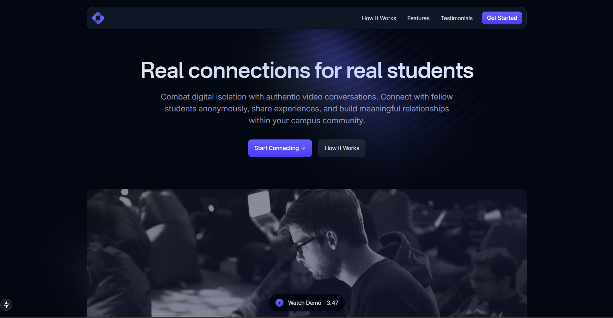

# Lowki - Real Connections for Real Students



**Lowki** is a **real-time social video platform designed specifically for university students**. This landing page showcases Lowki's mission to combat digital isolation through authentic, anonymous video conversations with fellow students.

Built with **Next.js and Tailwind CSS** for optimal performance and user experience.

## About Lowki

Lowki allows students to engage in short, anonymous video conversations with peers who share similar interests, experiences, or goals. The platform fosters meaningful peer-to-peer interaction in a safe, spontaneous, and low-pressure environment.

### Key Features
- **Anonymous Mode**: Maintain privacy with blur filters and avatars
- **Interest-Based Matching**: Connect with like-minded students
- **Campus Filtering**: Match within your school or across regions
- **Time-Limited Events**: Join themed chat rooms and conversations
- **AI-Powered Moderation**: Safe and secure environment

## Getting Started

This is a [Next.js](https://nextjs.org/) project bootstrapped with [`create-next-app`](https://github.com/vercel/next.js/tree/canary/packages/create-next-app).

First, run the development server:

```bash
npm run dev
# or
pnpm dev (recommended)
# or
yarn dev
```

Open [http://localhost:3000](http://localhost:3000) with your browser to see the result.

You can start editing the page by modifying `app/page.tsx`. The page auto-updates as you edit the file.

This project uses [`next/font`](https://nextjs.org/docs/basic-features/font-optimization) to automatically optimize and load custom fonts.

## Learn More

To learn more about Next.js, take a look at the following resources:

- [Next.js Documentation](https://nextjs.org/docs) - learn about Next.js features and API.
- [Learn Next.js](https://nextjs.org/learn) - an interactive Next.js tutorial.

## Deploy on Vercel

The easiest way to deploy your Next.js app is to use the [Vercel Platform](https://vercel.com/new?utm_medium=default-template&filter=next.js&utm_source=create-next-app&utm_campaign=create-next-app-readme) from the creators of Next.js.

Check out our [Next.js deployment documentation](https://nextjs.org/docs/deployment) for more details.

## Technical Notes

This project has been developed with the App Router (`app`) and React Server Components. Built with Tailwind v4 support for modern styling capabilities.

## About Navara

Lowki is part of Navara's suite of digital platforms designed to solve core problems faced by university students. Navara is building technology that empowers students through meaningful connections and opportunities within the campus ecosystem.

> Navara is not just a tech company. It's a movement — built by students, for students.
You can check out [the Next.js GitHub repository](https://github.com/vercel/next.js/) - your feedback and contributions are welcome!

### Deploy on Vercel

The easiest way to deploy your Next.js app is to use the [Vercel Platform](https://vercel.com/new?utm_medium=default-template&filter=next.js&utm_source=create-next-app&utm_campaign=create-next-app-readme) from the creators of Next.js.

Check out our [Next.js deployment documentation](https://nextjs.org/docs/deployment) for more details.

### Support notes

This template has been developed with the App Router (`app`) and React Server Components. If you’re unfamiliar with these beta features, you can find more information about them on the Next.js beta documentation page. So, please note that any request dealing with React (e.g. extra features, customisations, et cetera) is to be considered out of the support scope.

For more information about what support covers, please see our (FAQs)[https://cruip.com/faq/].

## Credits

- [Nucleo](https://nucleoapp.com/)

## Terms and License

- Released under the [GPL](https://www.gnu.org/licenses/gpl-3.0.html).
- Copyright 2024 [Cruip](https://cruip.com/).
- Use it for personal and commercial projects, but please don’t republish, redistribute, or resell the template.
- Attribution is not required, although it is really appreciated.

## About Us

We're an Italian developer/designer duo creating high-quality design/code resources for developers, makers, and startups.

## Stay in the loop

If you would like to know when we release new resources, you can follow [@pacovitiello](https://x.com/pacovitiello) and [@DavidePacilio](https://x.com/DavidePacilio) on X, or you can subscribe to our [newsletter](https://cruip.com/newsletter/).
